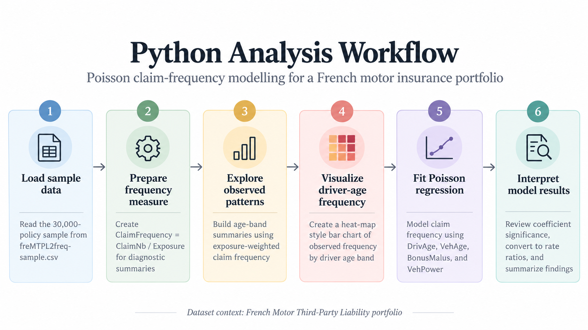

## Question
::: {.callout-important}
## Analytical objective

Can a simple Poisson regression model explain automobile claim frequency using common insurance rating variables in a French motor insurance portfolio?
:::

### At a glance

- **Portfolio:** French Motor Third-Party Liability insurance portfolio
- **Geography:** France
- **Sample size:** 30,000 policies
- **Goal:** Evaluate whether a simple Poisson regression can explain claim frequency using common insurance rating variables
- **Method:** Poisson GLM with claim count as the response and standard rating variables as predictors

## Data
This analysis uses a 30,000-policy simple random sample drawn without replacement in R using `set.seed(521)` from the [`freMTPL2freq`](https://github.com/dutangc/CASdatasets/blob/master/data/freMTPL2freq.rda) French Motor Third-Party Liability dataset, which represents automobile insurance policies from France.

**Data source:** [`freMTPL2freq`](https://github.com/dutangc/CASdatasets/blob/master/data/freMTPL2freq.rda) from the [CASdatasets repository](https://github.com/dutangc/CASdatasets).

**Licence:** [Etalab Open Licence 2.0](https://github.com/etalab/Licence-Ouverte/blob/master/LO.md).

The original dataset contains policy-level claim counts, exposure, driver,
vehicle, and geographic characteristics.

```{python}
#| label: load-data
#| warning: false
#| message: false
import pandas as pd

insurance = pd.read_csv("freMTPL2freq-sample.csv")

rows, columns = insurance.shape

print(f"The analysis dataset contains {rows:,} policies and {columns} variables.")

insurance.head()
```

{fig-align="center" width="85%"}

## Analysis
Claim frequency measures the number of claims relative to the amount of exposure. Because policies in the dataset have different exposure periods, comparing raw claim counts alone would not be appropriate.
```{python}
#| label: prepare-frequency

insurance["ClaimFrequency"] = (
    insurance["ClaimNb"] / insurance["Exposure"]
)

insurance[
    ["ClaimNb", "Exposure", "ClaimFrequency"]
].describe()
```

::: {.callout-warning}
## Interpretation note

The mean of the policy-level `ClaimFrequency` column should not be interpreted as the overall portfolio claim frequency. Because individual policies have different exposure periods, the portfolio-level measure is calculated using total claims divided by total exposure rather than by averaging individual policy frequencies.
:::
<br><br>
To examine how observed claim frequency varies with driver age, drivers are
grouped into age bands. Claim frequency for each group is calculated using
total claims divided by total exposure.
```{python}
#| label: driver-age-summary

age_bins = [17, 24, 34, 44, 54, 64, 74, 100]
age_labels = ["18–24", "25–34", "35–44", "45–54",
              "55–64", "65–74", "75–100"]

insurance["DriverAgeBand"] = pd.cut(
    insurance["DrivAge"],
    bins=age_bins,
    labels=age_labels
)

age_summary = (
    insurance
    .groupby("DriverAgeBand", observed=True, as_index=False)
    .agg(
        Policies=("IDpol", "count"),
        Claims=("ClaimNb", "sum"),
        Exposure=("Exposure", "sum")
    )
)

age_summary["ObservedFrequency"] = (
    age_summary["Claims"] / age_summary["Exposure"]
)

age_summary
```

```{python}
#| label: fig-driver-age-frequency
#| fig-cap: "Observed automobile claim frequency by driver age band in a French Motor Third-Party Liability insurance portfolio."
#| echo: false

import matplotlib.pyplot as plt
import matplotlib as mpl

values = age_summary["ObservedFrequency"]
labels = age_summary["DriverAgeBand"].astype(str)

norm = mpl.colors.Normalize(
    vmin=values.min(),
    vmax=values.max()
)

cmap = mpl.colormaps["YlOrRd"]
bar_colors = cmap(norm(values))

fig, ax = plt.subplots(
    figsize=(7.2, 4.4),
    constrained_layout=True
)

bars = ax.bar(
    labels,
    values,
    color=bar_colors,
    edgecolor="#555555",
    linewidth=0.7,
    width=0.68
)

for bar, value in zip(bars, values):
    ax.text(
        bar.get_x() + bar.get_width() / 2,
        value + 0.003,
        f"{value:.3f}",
        ha="center",
        va="bottom",
        fontsize=8,
        fontweight="bold"
    )

ax.set_title(
    "Observed Claim Frequency by Driver Age Band\n"
    "French Motor Insurance Portfolio",
    fontsize=12.5,
    fontweight="bold",
    pad=11
)

ax.set_xlabel(
    "Driver age band",
    fontsize=9
)

ax.set_ylabel(
    "Claims per unit of exposure",
    fontsize=9
)

ax.tick_params(
    axis="both",
    labelsize=8
)

ax.grid(
    axis="y",
    linestyle="--",
    alpha=0.20
)

ax.set_axisbelow(True)

ax.spines["top"].set_visible(False)
ax.spines["right"].set_visible(False)

ax.set_ylim(
    0,
    values.max() * 1.16
)

ax.margins(x=0.03)

sm = mpl.cm.ScalarMappable(
    cmap=cmap,
    norm=norm
)

sm.set_array([])

cbar = fig.colorbar(
    sm,
    ax=ax,
    pad=0.015,
    fraction=0.03,
    shrink=0.66
)

cbar.ax.set_title(
    "Frequency",
    fontsize=9,
    pad=6
)

cbar.ax.yaxis.set_major_locator(
    mpl.ticker.MaxNLocator(nbins=4)
)

cbar.ax.tick_params(
    labelsize=7
)

plt.show()
```

Observed claim frequency is highest for drivers aged 18–24, at about 0.181 claims per unit of exposure. Frequency drops sharply for the 25–34 group and remains lower across most older age bands, reaching its lowest level for drivers aged 65–74.

The 75–100 group shows a modest increase in frequency. These are descriptive portfolio-level patterns, not causal effects, and the groups contain different amounts of exposure.

::: {.callout-tip}
## Key takeaway

The descriptive age-band chart suggests that claim frequency is highest for younger drivers, while the regression results show that once several rating variables are considered together, the strongest modeled signals come from `BonusMalus`, `VehPower`, and `VehAge`.
:::

## Results
A Poisson generalized linear model is fitted to the policy-level claim counts. Policy exposure is included through a log-offset so that policies observed for different lengths of time are compared on a consistent basis.

```{python}
#| label: poisson-model

import numpy as np
import statsmodels.api as sm
import statsmodels.formula.api as smf

poisson_model = smf.glm(
    formula="ClaimNb ~ DrivAge + VehAge + BonusMalus + VehPower",
    data=insurance,
    family=sm.families.Poisson(),
    offset=np.log(insurance["Exposure"])
).fit()

poisson_model.summary()
```

::: {.callout-important}
## Model signals

- `BonusMalus`, `VehAge`, and `VehPower` are statistically significant in this model.
- `DrivAge` is not statistically significant after controlling for the other included variables.
:::

Because Poisson regression uses a log link, the raw coefficients are easier to interpret after exponentiation as multiplicative effects on expected claim frequency.
```{python}
#| label: poisson-rate-ratios

rate_ratios = pd.DataFrame({
    "Variable": poisson_model.params.index,
    "RateRatio": np.exp(poisson_model.params),
    "PValue": poisson_model.pvalues
})

rate_ratios
```

The rate ratios make the model effects easier to interpret. Holding the other variables constant, a one-unit increase in `BonusMalus` is associated with approximately a 2.5% increase in expected claim frequency, while a one-unit increase in `VehPower` is associated with approximately a 4.6% increase.

`VehAge` has a rate ratio below 1, corresponding to an estimated 1.6% decrease in expected claim frequency for each additional year of vehicle age. In contrast, the estimated effect of `DrivAge` is small and not statistically significant in this model.

These estimates describe conditional associations within the sampled French motor portfolio and should not be interpreted as causal effects.

## Conclusion
The Poisson regression provides evidence that several common insurance rating variables are associated with claim frequency in this sampled French motor portfolio.

`BonusMalus` and `VehPower` are associated with higher expected claim frequency, while `VehAge` is associated with a modest decrease. `DrivAge` is not statistically significant after controlling for the other variables included in the model.

Overall, the model shows that claim frequency can be partially explained using standard policy and vehicle characteristics, although the low pseudo-R² indicates that substantial variation remains unexplained. The results should therefore be viewed as a simple baseline model rather than a complete pricing model.

::: {.callout-note}
## Bottom line

The Poisson GLM identifies meaningful rating-variable associations, but its limited explanatory power means it should be viewed as a baseline model rather than a complete pricing framework.
:::