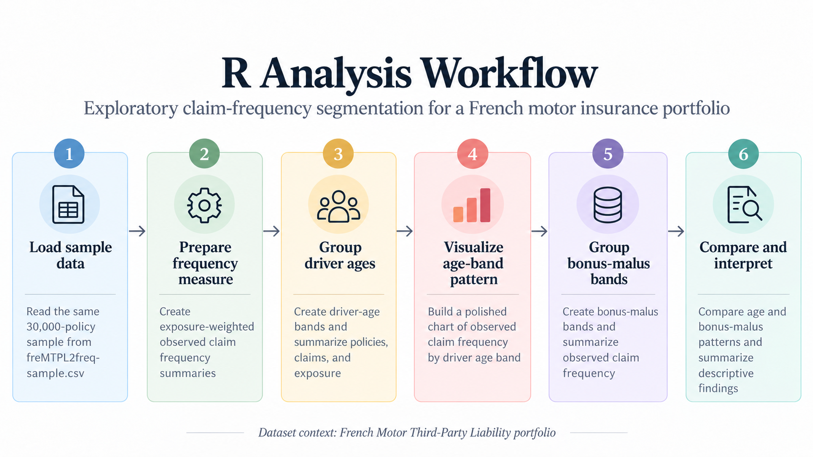

## Question

::: {.callout-tip}
## Analytical objective

How does automobile claim frequency vary across key driver and policy characteristics in a French motor insurance portfolio?
:::

### At a glance

- **Portfolio:** French Motor Third-Party Liability insurance portfolio
- **Geography:** France
- **Sample size:** 30,000 policies
- **Goal:** Explore how claim frequency varies across key driver and policy segments
- **Method:** Exposure-weighted grouped summaries by driver age and bonus-malus bands

## Data

This analysis uses the same 30,000-policy simple random sample drawn without replacement in R using `set.seed(521)` from the [`freMTPL2freq`](https://github.com/dutangc/CASdatasets/blob/master/data/freMTPL2freq.rda) French Motor Third-Party Liability dataset, which represents automobile insurance policies from France.

**Data source:** [`freMTPL2freq`](https://github.com/dutangc/CASdatasets/blob/master/data/freMTPL2freq.rda) from the [CASdatasets repository](https://github.com/dutangc/CASdatasets).

**Licence:** [Etalab Open Licence 2.0](https://github.com/etalab/Licence-Ouverte/blob/master/LO.md).

The original dataset contains policy-level claim counts, exposure, driver, vehicle, and geographic characteristics.

```{r}
#| label: load-data
#| message: false
#| warning: false

library(readr)
library(dplyr)
library(ggplot2)

insurance <- read_csv("freMTPL2freq-sample.csv")

rows <- nrow(insurance)
columns <- ncol(insurance)

cat(
  "The analysis dataset contains",
  format(rows, big.mark = ","),
  "policies and",
  columns,
  "variables."
)

head(insurance)
```

{fig-align="center" width="85%"}

## Analysis

Claim frequency is evaluated using total claims divided by total exposure so that policies with different exposure periods are weighted appropriately.
```{r}
#| label: driver-age-summary

insurance <- insurance |>
  mutate(
    DriverAgeBand = cut(
      DrivAge,
      breaks = c(17, 24, 34, 44, 54, 64, 74, 100),
      labels = c(
        "18–24", "25–34", "35–44", "45–54",
        "55–64", "65–74", "75–100"
      )
    )
  )

age_summary <- insurance |>
  group_by(DriverAgeBand) |>
  summarise(
    Policies = n(),
    Claims = sum(ClaimNb),
    Exposure = sum(Exposure),
    ObservedFrequency = Claims / Exposure,
    .groups = "drop"
  )

age_summary
```

### Bonus-malus segmentation

To examine another common insurance rating variable, `BonusMalus` is grouped into bands and summarized using the same exposure-weighted claim frequency measure.
```{r}
#| label: bonus-malus-summary

insurance <- insurance |>
  mutate(
    BonusMalusBand = cut(
      BonusMalus,
      breaks = c(49, 59, 69, 79, 99, Inf),
      labels = c(
        "50–59", "60–69", "70–79", "80–99", "100+"
      )
    )
  )

bonus_summary <- insurance |>
  group_by(BonusMalusBand) |>
  summarise(
    Policies = n(),
    Claims = sum(ClaimNb),
    Exposure = sum(Exposure),
    ObservedFrequency = Claims / Exposure,
    .groups = "drop"
  )

bonus_summary
```

The descriptive patterns can be compared visually using the same exposure-weighted claim frequency measure.
```{r}
#| label: fig-driver-age-frequency-r
#| fig-cap: "Observed claim frequency by driver age band in a French motor insurance portfolio."
#| warning: false
#| message: false
#| echo: false

age_plot <- ggplot(
  age_summary,
  aes(x = DriverAgeBand, y = ObservedFrequency, fill = ObservedFrequency)
) +
  geom_col(width = 0.75) +
  geom_text(
    aes(label = sprintf("%.3f", ObservedFrequency)),
    vjust = -0.5,
    size = 3.5,
    fontface = "bold"
  ) +
  scale_fill_gradient(
    low = "#FFF3B0",
    high = "#9E0142"
  ) +
  labs(
    title = "Observed Claim Frequency by Driver Age Band",
    subtitle = "French Motor Insurance Portfolio",
    x = "Driver age band",
    y = "Claims per unit of exposure",
    fill = "Frequency"
  ) +
  theme_minimal(base_size = 12) +
  theme(
    legend.position = "right",
    panel.grid.major.x = element_blank(),
    plot.title = element_text(face = "bold", size = 15),
    plot.subtitle = element_text(size = 11)
  ) +
  expand_limits(y = max(age_summary$ObservedFrequency) * 1.15)

age_plot
```

```{r}
#| label: fig-bonus-malus-frequency-r
#| fig-cap: "Observed claim frequency by bonus-malus band in a French motor insurance portfolio."
#| warning: false
#| message: false
#| echo: false
bonus_plot <- ggplot(
  bonus_summary,
  aes(x = BonusMalusBand, y = ObservedFrequency, fill = ObservedFrequency)
) +
  geom_col(width = 0.75) +
  geom_text(
    aes(label = sprintf("%.3f", ObservedFrequency)),
    vjust = -0.5,
    size = 3.5,
    fontface = "bold"
  ) +
  scale_fill_gradient(
    low = "#FFF3B0",
    high = "#9E0142"
  ) +
  labs(
    title = "Observed Claim Frequency by Bonus-Malus Band",
    subtitle = "French Motor Insurance Portfolio",
    x = "Bonus-malus band",
    y = "Claims per unit of exposure",
    fill = "Frequency"
  ) +
  theme_minimal(base_size = 12) +
  theme(
    legend.position = "right",
    panel.grid.major.x = element_blank(),
    plot.title = element_text(face = "bold", size = 15),
    plot.subtitle = element_text(size = 11)
  ) +
  expand_limits(y = max(bonus_summary$ObservedFrequency) * 1.15)

bonus_plot
```

::: {.callout-tip}
## Key takeaway

Observed claim frequency varies substantially across both driver age and bonus-malus bands.

For driver age, the 18–24 group has the highest observed frequency at approximately 0.181 claims per unit of exposure. Frequency drops sharply for drivers aged 25–34 and remains lower across most older age groups, reaching its lowest level for drivers aged 65–74 before increasing again for the 75–100 group.

The bonus-malus pattern is more pronounced. Observed frequency rises from approximately 0.057 for the 50–59 band to 0.244 for policies with a bonus-malus value of 100 or higher. This suggests a strong descriptive relationship between higher bonus-malus values and higher claim frequency in the sampled portfolio.

These patterns are descriptive portfolio-level associations and should not be interpreted as causal effects.
:::

## Results

::: {.callout-important}
## What stands out

- The `18–24` age band has the highest observed claim frequency among the driver-age groups.
- The lowest observed driver-age frequency appears in the `65–74` band.
- The strongest segmentation appears across `BonusMalus`, with the `100+` band showing substantially higher observed frequency.
:::

Taken together, the grouped summaries show meaningful segmentation in observed claim frequency across both dimensions.

The bonus-malus pattern is particularly pronounced, with substantially greater separation between bands than in the driver-age comparison. This is consistent with the role of bonus-malus as a rating variable reflecting prior claims experience or risk differentiation.

Overall, the R analysis suggests that both driver age and bonus-malus are useful for segmenting observed claim frequency within this French motor portfolio.

## Conclusion

The exploratory analysis shows clear differences in observed claim frequency across both driver age and bonus-malus segments in this sampled French motor portfolio.

Younger drivers, particularly those aged 18–24, have higher observed claim frequency than most older age groups. The strongest segmentation appears across bonus-malus bands, where higher values are associated with substantially higher observed claim frequency.

These findings support the use of driver and policy characteristics for descriptive risk segmentation, while remaining portfolio-level associations rather than causal relationships.

::: {.callout-note}
## Bottom line

Driver age and bonus-malus both provide useful descriptive segmentation of claim frequency in this sample, with bonus-malus showing the stronger overall pattern.
:::